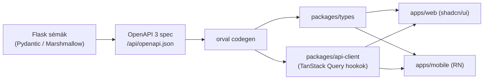

API-szerződés: OpenAPI és kódgenerálás

A web és a mobil **egyetlen REST API-t** fogyaszt (5.5). Hogy ez a szerződés **drift-mentes** legyen, a backend **OpenAPI 3** specet ad, és abból **generáljuk** a frontend típusait és kliensét. Egy forrás → nincs kézi szinkron a backend, a web és a mobil között.

