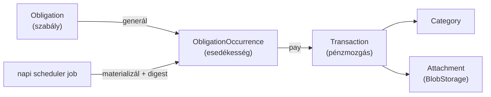

# Kiadás-rögzítés + havi áttekintő — Feature terv

## Context

A HomeOps célja, hogy a háztartás összes visszatérő kötelezettségét, határidejét, kiadását
és bevételét egy helyen tartsa, és időben emlékeztessen. Ez a dokumentum az **első
pénzügyi feature** tervét rögzíti: kiadás/bevétel rögzítése, ismétlődő számlák (rezsi,
biztosítás) esedékesség-kezeléssel, kategóriák és tagek, csatolt számla-PDF/kép, szűrés
tárgyévre/tárgyhóra, dashboard és esedékesség-emlékeztetők — weben és mobilon egyaránt.

A feladat kimenete **ez a tervdokumentum**. A megvalósítás (backend → migráció → frontend →
mobil) a terv jóváhagyása után, külön lépésekben történik.

A meglévő jogosultság-katalógus (`backend/app/domain/enums.py`) már megkülönböztet
`expense.*` és `obligation.*` engedélyeket, és van scheduler-port
(`app/tasks/scheduler.py`, külön worker-folyamat) + email-pipeline
(`app/notifications/email`). Ez a terv ezekre épít. **Fájltárolás még nincs** a kódbázisban
— ezt a feature vezeti be (port + adapter mintával).

### Megerősített termékdöntések (grilling eredménye)

1. **Két entitás**: `Transaction` (rögzített tény) + `Obligation` (ismétlődő/egyszeri szabály),
   közöttük linkkel — illeszkedik a meglévő `expense.*` / `obligation.*` jogokhoz.
2. **Materializált esedékességek**: a szabály konkrét `ObligationOccurrence` sorokat generál
   előre; az emlékeztető egyszerű lekérdezés.
3. **Kötött ismétlődés**: `interval_unit` (MONTH/YEAR) + `interval_count` + `anchor_day` +
   `start_date` (+ opcionális `end_date`); egyszeri = nincs recurrence. Nincs RRULE.
4. **Kifizetés = mindig új Transaction** (előkitöltött, szerkeszthető összeg). Nincs
   "meglévőt linkelek" út.
5. **Kategória**: household-szintű entitás, magyar alapértelmezettekkel seedelve;
   `kind` (EXPENSE/INCOME/BOTH). Egy tranzakció = egy kategória (FK).
6. **Tagek**: szabad szöveges, normalizált string tömb (`TEXT[]` + GIN), usage-alapú
   autocomplete. Nincs külön kezelőfelület.
7. **Csatolmány**: `BlobStorage` **port + local-disk adapter most**, S3-kompatibilis adapter
   később. Több csatolmány / tranzakció; PDF + JPEG/PNG, ~10 MB cap.
8. **Egy household = egy pénznem** (`households.default_currency`, HUF). A `currency` oszlop
   kitöltődik a jövőbeli többdevizs bővítéshez.
9. **Emlékeztető**: napi **digest email** (esedékes + lejárt együtt), per-obligation
   `reminder_lead_days` (alap 5). Push később, ugyanazzal a generáló logikával.
10. **Címzettek**: OWNER/ADMIN/MEMBER; opcionális `responsible_member` személyre szabja.
    VIEWER/CHILD nem kap emlékeztetőt.
11. **Dashboard lean**: KPI sor + rövid "következő esedékesek" glimpse. A többi tartalom
    dedikált oldalakon (Számlák, Tranzakciók, Riportok).
12. **Obligation szerkesztés**: csak a **nem fizetett** (jövőbeli + lejárt-nyitott)
    occurrence-ök frissülnek; a fizetettek befagyott történet.
13. **Törlés**: tranzakció = **hard delete** + a linkelt occurrence visszavált DUE-ra;
    obligation/kategória = **archiválás**, soha nem cascade-eli a tranzakciókat.
14. **Pagináció**: offset/limit (`page` + `per_page`) — ez lesz az új házkonvenció.
15. **Obligation iránya**: EXPENSE | INCOME (recurring salary/jóváírás is sablonozható).
16. **Láthatóság**: VIEWER megkapja az `expense.read`-et (csak-olvasó), CHILD kimarad.
17. **Mobil**: amount-first quick-add bottom sheet + kamera/galéria számla-capture.

### Kifejezetten Phase 2 (v1-en kívül)

Havi büdzsé/keret kategóriánként · tagok közti elszámolás (Splitwise-szerű) · banki/CSV
import · számla-OCR (összeg/dátum auto-kinyerés) · többdevizs + árfolyam · obligation-szintű
csatolmány (szerződés PDF) · per-user notification preferenciák · push (FCM/APNs).

### Rögzített feltételezések

- **Időszak-csoportosítás** a `Transaction.booked_on` (plain DATE) szerint; a digest fix napi
  órában megy. A household-nak nincs timezone mezője — ha kell, az külön, kicsi bővítés.
- **Occurrence-generálás horizontja**: alapból 3 hónap előre, napi top-up jobbal
  (konfigurálható).

---

## Architektúra (összefoglaló)

A meglévő réteges minta megtartása: **route (vékony kontroller) → service → repository**,
APIFlask + Pydantic sémák (→ OpenAPI → generált `api-client`). Minden új tábla
**tenant-scoped** (`household_id` diszkrimináns) → RLS érvényes, a `session_scope(household_id=…)`
mintával (lásd `household_service`). A controllerek a meglévő minta szerint kikényszerítik,
hogy a path `{household_id}` egyezzen a token aktív household-jával.



---

## Backend

### 1. Új függőség

- `boto3` (vagy `minio`) **csak** az S3-adapterhez — Phase 2-ben kerül be. A v1 local-disk
  adapter standard library-vel megoldható.
- Recurrence-számításhoz `python-dateutil` (`relativedelta`) — robusztus hónap-aritmetika
  (hónap-végi `anchor_day` klampelés).

### 2. Adatmodell — `backend/app/db/models.py`

A pénz-szabály végig: `BigInteger *_amount_minor` + `CHAR(3) currency` a `currency_iso4217`
CHECK mintával (lásd `Household`). Minden tábla `household_id` FK (CASCADE) + index.

- **`Category`** (tenant-scoped):
  - `household_id`, `name` (String(80)), `color` (String(16)), `icon` (String(48)),
    `kind` CHECK IN ('EXPENSE','INCOME','BOTH'), `is_archived` (bool, default false),
    `created_at`/`updated_at`
  - unique `(household_id, name)` aktív kategóriákra (partial index `WHERE is_archived = false`)

- **`Transaction`** (tenant-scoped):
  - `household_id`, `direction` CHECK IN ('EXPENSE','INCOME'),
    `amount_minor` (BigInteger), `currency` (CHAR(3), default household currency),
    `booked_on` (Date), `category_id` (FK categories, ondelete RESTRICT),
    `tags` (`ARRAY(Text)`, default `[]`), `note` (Text, nullable),
    `counterparty` (String(160), nullable), `created_by` (FK users, SET NULL),
    `occurrence_id` (FK obligation_occurrences, SET NULL, nullable, unique),
    `created_at`/`updated_at`
  - indexek: `(household_id, booked_on)`, GIN a `tags`-re, `(household_id, category_id)`

- **`Obligation`** (tenant-scoped):
  - `household_id`, `name` (String(120)), `direction` CHECK IN ('EXPENSE','INCOME'),
    `category_id` (FK), `expected_amount_minor` (BigInteger), `currency` (CHAR(3)),
    `interval_unit` CHECK IN ('MONTH','YEAR'), `interval_count` (Integer, >=1),
    `anchor_day` (Integer 1–31), `start_date` (Date), `end_date` (Date, nullable),
    `reminder_lead_days` (Integer, default 5), `responsible_member_id` (FK memberships,
    SET NULL, nullable), `is_active` (bool, default true), `created_by`,
    `created_at`/`updated_at`
  - egyszeri kiadás = `interval_count` NULL/0 jelzéssel vagy külön `is_recurring` flaggel
    (implementációkor véglegesítendő — javaslat: `is_recurring` bool, false → egyetlen
    occurrence a `start_date`-re).

- **`ObligationOccurrence`** (tenant-scoped):
  - `household_id`, `obligation_id` (FK, CASCADE), `due_date` (Date),
    `expected_amount_minor` (BigInteger), `currency` (CHAR(3)),
    `status` CHECK IN ('DUE','PAID','SKIPPED','OVERDUE'),
    `transaction_id` (FK transactions, SET NULL, nullable),
    `created_at`/`updated_at`
  - unique `(obligation_id, due_date)` — idempotens materializálás
  - index `(household_id, status, due_date)` — emlékeztető-lekérdezés

- **`Attachment`** (tenant-scoped):
  - `household_id`, `transaction_id` (FK, CASCADE), `filename` (String(255)),
    `content_type` (String(100)), `size` (BigInteger), `storage_key` (String(512)),
    `checksum` (String(64)), `uploaded_by` (FK users, SET NULL), `created_at`
  - index `transaction_id`-re

### 3. Migráció — `backend/migrations/versions/`

Új Alembic revízió: az öt tábla + FK-k + indexek + CHECK-ek + **RLS policy-k** mindegyikre
(a `households`/`memberships` tenant-policy mintát követve). Seed: alapértelmezett magyar
kategóriák **nem** migrációban, hanem a household-létrehozáskor a service-ben (lásd 6.),
hogy ne kelljen minden meglévő household-ra külön backfill — az új household-ök kapják.
Ha a meglévő household-okra is kell, külön data-migration lépés.

### 4. Tárolás — `backend/app/integrations/storage.py` (új) + adapter

Port + adapter a `Scheduler`/`SecretCipher` mintára:

```python
class BlobStorage(Protocol):
    def put(self, key: str, data: BinaryIO, *, content_type: str) -> None: ...
    def get(self, key: str) -> BinaryIO: ...
    def delete(self, key: str) -> None: ...
```

- **v1**: `LocalDiskStorage` — egy mountolt volume alá ír, `key` = `households/{hid}/tx/{txid}/{uuid}{ext}`.
- **Phase 2**: `S3Storage` (boto3/minio) ugyanazzal az interfésszel — config-kapcsolóval cserélhető.
- A controller streameli a multipart feltöltést, validál (content-type whitelist, méret-cap),
  checksumot számol, majd a service `Attachment` sort ír + `storage.put`-ot hív.

### 5. Recurrence + occurrence-generálás — `backend/app/services/`

- `recurrence.py` (tiszta függvény, lib-független): adott obligation + horizont → due_date lista
  (`relativedelta`, hónap-végi klampelés, `end_date` tisztelete).
- `obligation_service.py`: CRUD + `materialize_occurrences(horizon_months=3)` (idempotens, az
  unique `(obligation_id, due_date)` miatt), `pay(occurrence_id, amount?, …)` → új Transaction
  + occurrence PAID, `skip(occurrence_id)`. Szerkesztéskor csak a **nem PAID** occurrence-ök
  frissülnek/újragenerálódnak.
- `transaction_service.py`: CRUD, szűrt+paginált lista, **hard delete** (ha van linkelt
  occurrence → vissza DUE). Aggregációk (overview) itt vagy külön `reporting_service`-ben.
- Minden privilegizált művelet `authorization.require_permission(...)`-nel (a meglévő
  `expense.write` / `obligation.write` / `expense.read` engedélyekkel).

### 6. Jogosultság-katalógus változás — `backend/app/domain/enums.py`

- `ROLE_PERMISSIONS[VIEWER]` kiegészül `"expense.read"`-del (csak-olvasó pénzügy).
- A meglévő `expense.*` / `obligation.*` / `document.*` (csatolmányhoz) engedélyek elegendők.
- CHILD változatlan (nem lát pénzügyet).
- A változás új migrációt igényel a `roles.permissions` JSONB frissítéséhez (seed-update).

### 7. Pagináció — közös helper

Új központi util (offset/limit): `page` (default 1), `per_page` (default 25, max 100).
Response burok: `{ items: [...], page, per_page, total }`. Ez lesz a házkonvenció minden
jövőbeli listához.

### 8. Emlékeztetők — `backend/app/notifications` + `app/tasks`

- Napi scheduler job (a meglévő `Scheduler` porton, **csak a workerben**): (1) hiányzó
  occurrence-ök materializálása, (2) lejárt DUE → OVERDUE, (3) per-household digest
  összeállítása (esedékes a lead-ablakban + minden lejárt), (4) email a megfelelő
  címzetteknek (OWNER/ADMIN/MEMBER), a `responsible_member` kiemelésével.
- Új email-template pár: `obligation_digest.html.j2` / `.txt.j2` (a meglévő
  `messages.py` + `sender.py` mintára).

### 9. API felület (APIFlask blueprintek)

A `households.py` mintát követve (path-scoped + token-egyezés ellenőrzés, `operation_id`-k):

```
GET    /households/{id}/overview?year=&month=
        → { income_total, expense_total, net, by_category[], upcoming[], overdue[] }

GET    /households/{id}/transactions
        ?year=&month=&direction=&category_id=&tags=&q=&min_amount=&max_amount=&page=&per_page=
POST   /households/{id}/transactions
PATCH  /households/{id}/transactions/{txId}
DELETE /households/{id}/transactions/{txId}           (hard delete)

POST   /households/{id}/transactions/{txId}/attachments        (multipart)
GET    /households/{id}/transactions/{txId}/attachments/{aId}  (letöltés/stream)
DELETE /households/{id}/transactions/{txId}/attachments/{aId}

GET    /households/{id}/obligations
POST   /households/{id}/obligations
PATCH  /households/{id}/obligations/{obId}
DELETE /households/{id}/obligations/{obId}             (archiválás)

GET    /households/{id}/obligations/occurrences?status=&from=&to=&page=&per_page=
POST   /households/{id}/obligations/occurrences/{ocId}/pay     (body: amount?, booked_on?, note?)
POST   /households/{id}/obligations/occurrences/{ocId}/skip

GET    /households/{id}/categories
POST   /households/{id}/categories
PATCH  /households/{id}/categories/{cId}
DELETE /households/{id}/categories/{cId}               (archiválás)

GET    /households/{id}/tags                            (autocomplete: használt tagek)
```

---

## Frontend (web — React + shadcn/ui)

A monorepo `apps/web` csomagja; a prezentáció-mentes rétegek (`api-client`, `core`,
`validation`, `i18n`, `tokens`) `packages/`-ből. A szerver-állapot hookjai a backend
OpenAPI-jából **generált** `api-client`-ből (orval + TanStack Query). i18n EN/HU az elejétől.

Oldalak (IA):

1. **Dashboard** (lean): KPI sor (bevétel / kiadás / egyenleg az időszakra) + rövid
   "következő esedékesek" glimpse (3–5 tétel, link a Számlák oldalra).
2. **Számlák / Esedékességek**: obligation-lista + CRUD; upcoming + overdue occurrence-lista
   pay/skip akcióval; "felelős" jelölés.
3. **Tranzakciók**: szűrhető, paginált lista (tárgyév/tárgyhó, típus, kategória, tag-chips,
   keresés, összeg-tartomány); létrehozás/szerkesztés dialógus; csatolmány feltöltés/letöltés.
4. **Riportok**: kategória-bontás (donut/bar) + havi trend (utóbbi 6–12 hó) — recharts vagy
   shadcn chart.
5. **Beállítások → Kategóriák**: kategória CRUD + archiválás (OWNER/ADMIN).

UI minden shadcn/ui-ból (a `shadcn-only` szabály szerint). Pénz- és dátumformázás a HU
locale szerint (`@homeops/i18n`/`core`).

---

## Mobil (React Native — Expo + gluestack-ui v4)

A `apps/mobile` csomag; ugyanazt a generált `api-client`-et és `validation` (zod) sémákat
fogyasztja, saját RN UI-réteggel (gluestack v4 + NativeWind, a `tokens` témából).

- **Amount-first quick-add bottom sheet**: nagy numerikus összeg-bevitel → kategória chipek →
  opcionális jegyzet/tag → opcionális **📷 számla** (kamera/galéria, `expo-image-picker`/
  `expo-camera`) → mentés. Cél: ~5 mp alatt rögzíthető egy kiadás.
- A fotó képcsatolmányként megy fel ugyanarra a `/attachments` endpointra.
- Esedékességek képernyő pay/skip akciókkal; dashboard KPI + glimpse.
- Token a secure store-ban (Keychain/Keystore), a meglévő mobil auth-minta szerint.

---

## Tesztelés

- **Backend**: unit a recurrence-számításra (hónap-végi klampelés, `end_date`, count>1),
  service-szintű a pay/skip/edit occurrence-szabályokra, integrációs a teljes flow-ra
  (a `tests/integration/test_household_flow.py` mintájára): obligation létrehozás →
  materializálás → pay → tranzakció megjelenik az overview-ban → delete → occurrence DUE.
  RLS-izoláció teszt (másik household nem látja). Digest-job teszt fix idővel.
- **Frontend/mobil**: a generált hookok köré komponens-szintű tesztek, zod-validáció.

---

## Megvalósítási sorrend (javaslat)

1. Migráció + modellek + RLS + jogosultság-katalógus update.
2. Category + Transaction service/repo/API + pagináció-helper.
3. Obligation + recurrence + occurrence materializálás + pay/skip API.
4. BlobStorage port + local-disk adapter + Attachment feltöltés/letöltés.
5. Overview/reporting endpoint.
6. Scheduler digest-job + email template.
7. Web oldalak (Dashboard → Tranzakciók → Számlák → Riportok → Kategóriák).
8. Mobil (quick-add + capture → esedékességek → dashboard).
