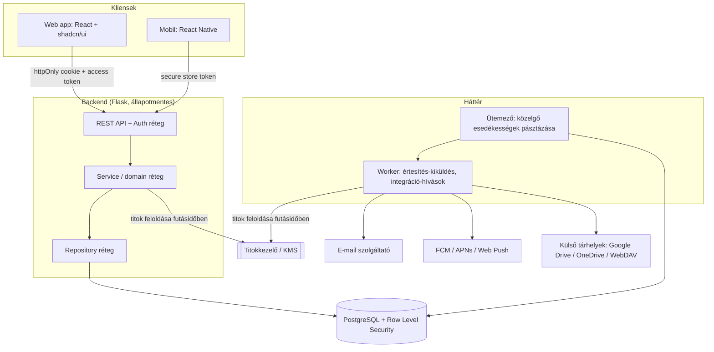
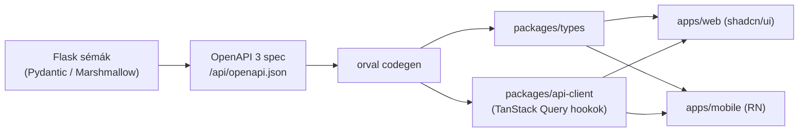
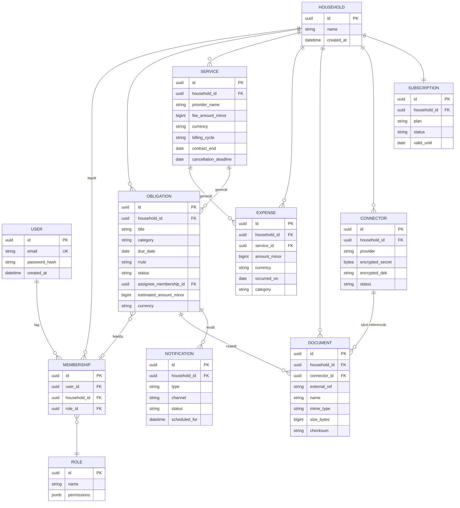
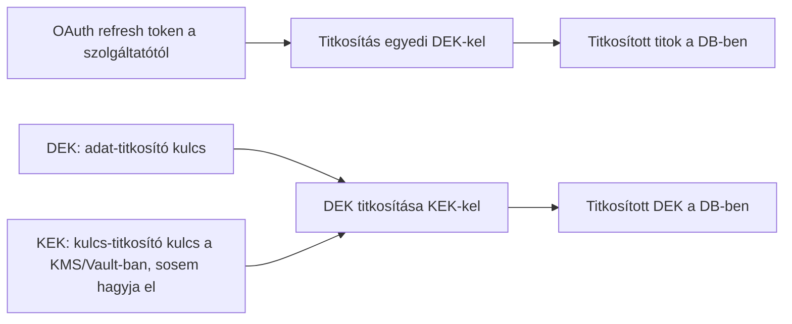
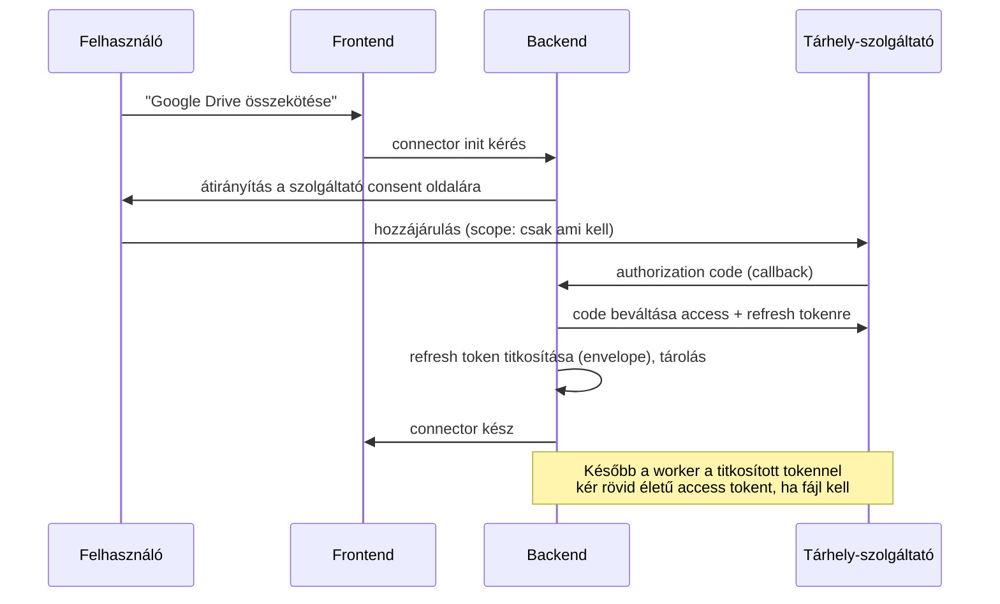

npx shadcn@latest init --preset b27JkRsW --template vite

# HomeOps — Részletes termék- és architektúra-specifikáció

> Háztartás-menedzsment SaaS: befizetések, okmányok, közüzemi szolgáltatások, dokumentumok és teendők egy átlátható felületen, családi (több felhasználós) használatra.

---

## 1. Vízió és pozicionálás

**Egymondatos vízió:** A HomeOps egy olyan közös háztartási „operációs rendszer", amely egyetlen átlátható felületen tartja nyilván egy otthon összes ismétlődő kötelezettségét, lejáratát, kiadását és dokumentumát, és időben figyelmeztet, mielőtt bármi elcsúszna.

**Kit szolgál:** elsősorban családokat / háztartásokat, ahol több felelős (szülők, esetleg nagyobb gyerekek) közösen visel adminisztrációs terhet. Másodlagosan kisebb albérleti közösségeket, ingatlankezelőket.

**Milyen fájdalmat old meg:**
- Az adminisztráció szét van szórva (papír, levél, app, fej), ezért dolgok kicsúsznak (lejárt biztosítás, kihagyott csekk, elmaradt karbantartás).
- Nincs egyetlen pont, ahol látszik a havi költés és a közelgő teendők.
- A felelősség nincs delegálva: mindig „valaki más" intézte volna.

**Alapelv — „a felelősség a szolgáltatóké, nem a HomeOpsé":** a rendszer **nyilvántartó és szervező felület**. Nem ő a fizetési szolgáltató, nem ő a tárhely, nem ő a hitelesítő hatóság. A fájlokat a felhasználó saját felhőjében (Google Drive / OneDrive / WebDAV) tartja, a HomeOps csak **hivatkozást és metaadatot** tárol. Ez nemcsak filozófiai döntés, hanem **kockázat- és felelősség-csökkentő architekturális elv** (lásd 8. fejezet).

---

## 2. Alapfogalmak (domain szótár)

Egy közös szótár nélkül az egész terv félreérthető. Az alábbi fogalmakat végig egységesen használom.

- **Háztartás (Household / Tenant):** a fő izolációs egység. Minden adat egy háztartáshoz tartozik. Egyben ez a *tenant* a multi-tenant SaaS értelmében.
- **Felhasználó (User):** egy globális, e-mailhez kötött személyes fiók. Egy felhasználó **több háztartásnak is tagja lehet** (pl. valaki a saját és a szülei háztartásában is).
- **Tagság (Membership):** a User ↔ Household kapcsolat, ami **szerepkört és jogosultságot** hordoz. Fontos: a szerepkör nem a felhasználón, hanem a tagságon él.
- **Szerepkör (Role):** előre definiált jogosultság-csomag (pl. `OWNER`, `ADMIN`, `MEMBER`, `VIEWER`, `CHILD`). Bővíthető.
- **Jogosultság (Permission):** finomszemcsés művelet-engedély (pl. `expense.read`, `document.delete`, `connector.manage`). A szerepkör jogosultságok halmaza.
- **Kötelezettség / Teendő (Obligation):** bármilyen elvégzendő/figyelendő dolog: csekk befizetése, biztosítás megújítása, hőszivattyú karbantartás, fa tápoldatozása. Lehet **egyszeri** vagy **ismétlődő** (RRULE alapon).
- **Szolgáltatás / Előfizetés (Service):** rendszeres kiadás vagy szerződés (Netflix, internet, biztosítás, közüzem). Költséget és lejáratot/megújítást is hordozhat.
- **Kiadás (Expense):** egy konkrét pénzmozgás vagy tervezett kiadás, opcionálisan egy Service-hez vagy Obligationhöz kötve.
- **Dokumentum (Document):** egy külső tárhelyen lévő fájl **referenciája** (provider, fájlazonosító, név, típus, méret, checksum) + kategória/címke.
- **Mérőóra-állás (MeterReading)** víz/gáz/villany leolvasások időbélyeggel — később hasznos a fogyasztás-trendekhez.
- **Konnektor (Connector):** egy külső integráció konfigurációja (pl. egy összekötött Google Drive fiók) + a hozzá tartozó **titkosított** hozzáférési titkok.
- **Értesítés (Notification):** egy generált figyelmeztetés (közelgő lejárat, esedékes fizetés) + a kézbesítési csatorna (e-mail / push) és státusz.

---

## 3. Funkcionális követelmények

### 3.1 Háztartás és multi-tenant kezelés
- Regisztrált felhasználó **létrehozhat** egy háztartást → automatikusan `OWNER` lesz.
- Egy felhasználó **több háztartásban** is részt vehet; a felületen háztartás-váltó.
- A háztartás tulajdonosa **meghívhat** tagokat e-mailben (egyszer használatos, lejáró meghívó-token).
- Háztartás archiválható / törölhető (soft delete + későbbi végleges törlés GDPR-okból).

### 3.2 Felhasználók, szerepkörök, jogosultságok (RBAC)
- Alap szerepkörök:
  - **OWNER** – mindent tud, beleértve a számlázást és a háztartás törlését.
  - **ADMIN** – tartalom + tagok kezelése, de nem törli a háztartást, nem kezeli a számlázást.
  - **MEMBER** – teendők, kiadások, dokumentumok létrehozása/szerkesztése.
  - **VIEWER** – csak olvasás (pl. nagyszülő, könyvelő).
  - **CHILD** – korlátozott, „gyerek" nézet (pl. csak a rá kiosztott teendők, pénzügyek elrejtve). Ez kielégíti az „Apa, Anya, gyerekek különböző jogosultsággal" igényt.
- A jogosultságok **finomszemcsések** (permission-alapúak), a szerepkör csak előre összerakott csomag. Ez teszi lehetővé a későbbi testreszabást.
- Felelős hozzárendelés: minden Obligation **felelőshöz (assignee)** rendelhető — így látszik, kinek a dolga.

### 3.3 Teendők / kötelezettségek (ismétlődés, határidők)
- Egyszeri és **ismétlődő** teendők. Az ismétlődés **iCal RRULE** szabvány szerint (`FREQ=YEARLY`, `FREQ=MONTHLY;BYMONTHDAY=15`, stb.) — ez ipari szabvány, nem kell saját ismétlés-logikát kitalálni.
- Mezők: cím, leírás, kategória, esedékesség (due date), felelős, prioritás, becsült/tényleges költség, csatolt dokumentum(ok), előzetes figyelmeztetés ideje (pl. „14 nappal előtte").
- Státuszok: `UPCOMING` → `DUE` → `DONE` / `OVERDUE` / `SKIPPED`.
- Ismétlődő teendőnél a következő előfordulás a befejezéskor (vagy ütemezetten) generálódik.
- Példák, amiket a domain modellnek le kell fednie: műszaki vizsga, biztosítás-megújítás, hőszivattyú karbantartás, kerti tápoldatozás, csekk befizetés.

### 3.4 Pénzügyek, kiadások, havi áttekintés
- Kiadás rögzítése: összeg (lásd lent), pénznem, dátum, kategória, ismétlődő-e, kapcsolt szolgáltatás.
- **Pénzügyi pontosság:** az összegeket **egész számként, a pénznem legkisebb egységében** (pl. fillér/cent) tároljuk, külön ISO 4217 pénznem-kóddal. **Soha nem float** (kerekítési hibák elkerülése).
- Havi áttekintés: kategóriánkénti bontás, fix vs. változó kiadás, „mire megy el a pénz" (Netflix, internet, biztosítások…), trend hónapról hónapra.
- Költségvetés (budget) később: kategória-limitek és túllépés-figyelmeztetés.

### 3.5 Szolgáltatások / előfizetések nyilvántartása
- Szolgáltatás = visszatérő szerződés/előfizetés: szolgáltató neve, díj, számlázási ciklus, szerződés kezdete/lejárata, felmondási határidő, dokumentum(ok).
- A szolgáltatás automatikusan **generálhat ismétlődő kiadást és teendőt** (pl. „lejár a szerződés 30 nap múlva").
- „Felmondási ablak" figyelmeztetés: sok szerződés csak adott időablakban mondható fel — ez konkrét értéknövelő funkció.

### 3.6 Dokumentum- és fájlkezelés (külső integráció)
- Támogatott konnektorok (fázisokban): **Google Drive**, **OneDrive**, **WebDAV** (és WebDAV-on keresztül Nextcloud/ownCloud, FTP-szerű tárhelyek).
- A HomeOps **nem tárolja a fájl bájtjait** — csak referenciát + metaadatot (provider, external_file_id vagy path, név, MIME, méret, checksum, kategória, kapcsolt entitás).
- Műveletek: fájl összerendelése egy teendőhöz/szolgáltatáshoz, kategorizálás, keresés metaadat alapján, megnyitás (rövid életű, igény szerint kért hozzáférés / signed URL — soha nem tartós nyilvános link).
- Ha a felhasználó lecsatol egy konnektort, a fájl-referenciák „árvává" válnak (jelezzük), de a fájl a felhasználó felhőjében marad — összhangban a felelősség-elvvel. 

### 3.7 Dashboard
A „tökéletes dashboard" konkrét widgetekre bontva (mit lát a felhasználó belépéskor):
- **Mai/közeli teendők** (a következő 7–30 nap, felelőssel).
- **Lejárati idővonal:** okmányok, szerződések, vizsgák a következő hónapokban.
- **Havi kiadás-összesítő:** aktuális hónap költése + kategória-bontás + előző hónaphoz képest.
- **Esedékes befizetések** kiemelve (késedelem = piros).
- **Aktív riasztások** (lejáró, túllépett).
- A nézet **szerepkör-érzékeny**: a `CHILD`/`VIEWER` nem látja a pénzügyi blokkokat.

### 3.8 Értesítési rendszer (e-mail + push)
- Esemény-típusok: közelgő lejárat, esedékes fizetés, túllépett (overdue) teendő, meghívó, heti összefoglaló (digest).
- Csatornák: **e-mail** (tranzakciós e-mail szolgáltatón át), **push** (mobil: FCM/APNs; web: Web Push). 
- A felhasználó **csatornánként és típusonként** állíthatja a preferenciáit, és az előzetes idő-ablakot (pl. „7 és 1 nappal előtte").
- Megbízhatóság: a generálás **háttér-ütemezővel** történik (napi pásztázás a közelgő esedékességekre) + **outbox pattern** a kézbesítés idempotens, újrapróbálható kiküldéséhez (nincs dupla e-mail, nincs elveszett értesítés).

### 3.9 Előfizetési / csomag modell (későbbi fázis)
A kódot már most úgy érdemes felépíteni, hogy a korlátok bevezethetők legyenek anélkül, hogy szét kéne szedni a rendszert:
- **Plan** (csomag) entitás: limitek pl. `max_members`, `max_services`, `max_connectors`, `max_storage_refs`, feature-kapcsolók (pl. push engedélyezett-e).
- A háztartáshoz egy aktív **Subscription** tartozik (plan + státusz + lejárat).
- **Feature-gate** réteg: minden korlátos művelet egy központi `entitlement` ellenőrzésen megy át. Így a csomag-logika **egy helyen** él (DRY), nem szóródik szét.
- Fizetés-integráció (pl. Stripe) **csak ekkor** kerül be — addig is a `Subscription` modell létezhet „free" planre állítva.

---

## 4. Nem-funkcionális követelmények

| Terület | Cél |
|---|---|
| **Biztonság** | OWASP ASVS L2 szintet célzó kontrollok; OWASP Top 10 lefedés (lásd 7.4). |
| **Adatvédelem** | GDPR: adatminimalizálás, export és törlés (right to erasure), célhoz kötött tárolás, naplózott hozzáférés. |
| **Tenant-izoláció** | Egy háztartás adata semmilyen úton nem szivároghat másikba (DB szintű RLS, lásd 5.2 és 7.2). |
| **Megbízhatóság** | Értesítés sosem vész el (outbox + retry); idempotens háttérfeladatok. |
| **Teljesítmény** | Dashboard < ~300 ms tipikus terhelésnél; megfelelő indexelés a háztartás-szűrésre és esedékesség-rendezésre. |
| **Skálázhatóság** | Állapotmentes (stateless) API → vízszintesen skálázható; háttér-worker külön skálázható. |
| **Megfigyelhetőség** | Strukturált log (request-id, household-id, **soha nem titok/PII**), metrikák, health-check végpontok. |
| **Kódminőség** | Clean Code, SOLID, DRY; réteges architektúra; magas tesztlefedettség a domain/service rétegen (lásd 9.). |

---

## 5. Architektúra

### 5.1 Magas szintű kép



### 5.2 Multi-tenancy stratégia — **ajánlás: közös séma + `household_id` + PostgreSQL RLS**

Három klasszikus megközelítés:

1. **Külön adatbázis tenantonként** — legerősebb izoláció, de SaaS-nál sok ezer háztartásnál üzemeltetési rémálom. *Elvetve.*
2. **Külön séma tenantonként** — közepes izoláció, bonyolult migráció sok tenantnál. *Elvetve MVP-re.*
3. **Közös séma, `household_id` diszkriminátor + Row Level Security** — egyetlen séma, minden táblán `household_id`, és **PostgreSQL RLS policy** garantálja, hogy a session csak a saját háztartása sorait lássa. **Ezt ajánlom.**

Az RLS azért kulcsfontosságú, mert **az adatbázis maga** kényszeríti ki az izolációt, nem csak az alkalmazás-kód. Ha valahol kimaradna egy `WHERE household_id = ?` szűrés (emberi hiba), az RLS akkor is megvéd. A backend minden tranzakció elején beállítja a kontextust (pl. `SET app.current_household = '<uuid>'`), és a policy erre szűr.

### 5.3 Backend (Flask) felépítése
Réteges, app-factory mintával (összhangban a Clean/SOLID elvekkel):

```
app/
  __init__.py        # create_app() factory, extension-init
  api/               # Blueprint-ek = REST végpontok (vékony controller)
  services/          # üzleti logika (itt él a domain szabály)
  repositories/      # adatelérés (SQLAlchemy), izolálva a service-től
  domain/            # entitások, value object-ek, enumok
  security/          # auth, jwt, jelszó-hash, RBAC, titokkezelés
  integrations/      # connector adapterek (gdrive, onedrive, webdav)
  notifications/     # értesítés-generálás és csatornák
  tasks/             # háttérfeladatok (scheduler/worker)
  config.py
```

Elvek a kódminőséghez (amit kértél):
- **Vékony controller, vastag service:** a Blueprint csak validál + delegál. A logika a service-ben van → tesztelhető, újrahasználható.
- **Repository absztrakció:** a service nem ismeri az SQL-t. Ez a *Dependency Inversion* (a „D" a SOLID-ban) és megkönnyíti a tesztelést.
- **DRY:** közös dolgok (paginálás, hibakezelés, entitlement-check, audit) egy-egy központi helyen.
- **Value object-ek:** pl. `Money` (összeg + pénznem) saját típusként, hogy ne szóródjon szét a pénz-logika.

> Megjegyzés a stackről: a réteges felépítés (controller → service → repository) és a SOLID/DRY elvek **keretrendszer-függetlenek** — pontosan ugyanaz a gondolkodás, mint egy Spring Boot világban (RestController → Service → Repository). Tehát a Flask választás nem korlátoz az enterprise-szintű minőségben; csak az eszközök mások.

### 5.4 Frontend (React + shadcn/ui)
- TypeScript, komponens-alapú, **szerver-állapot** kezelése pl. TanStack Query-vel (cache + újratöltés), nem nyers fetch szétszórva.
- shadcn/ui a dizájn-rendszer alapja (konzisztens, akadálymentes komponensek) — **web-only** marad (5.8).
- i18n már az elején (magyar/angol) — később a SaaS-nál hasznos.
- Az **access token csak memóriában** él (nem localStorage — XSS-kockázat), a frissítés httpOnly cookie-val (lásd 7.1).
- A web a monorepo **`apps/web`** csomagja; a prezentáció-mentes rétegeket (`api-client`, `core`, `validation`, `i18n`, `tokens`) a `packages/`-ből húzza (5.8). A szerver-állapot hookjai a backend OpenAPI-jából **generált** `api-client`-ből jönnek (5.9).

### 5.5 Mobil (React Native)
- A token a platform **secure store**-jában (iOS Keychain / Android Keystore), nem sima async storage-ban.
- Push: FCM (Android) + APNs (iOS), device-token regisztráció a backend felé.
- A mobil a monorepo **`apps/mobile`** csomagja (**Expo**); ugyanazokat a `packages/` modulokat fogyasztja, mint a web (5.8), de saját **RN UI-réteggel** (**NativeWind**, a `tokens` témából) — shadcn nélkül.
- A web és mobil **ugyanazt a REST API-t** használja → egyetlen, **OpenAPI-ból generált** szerződés (5.9), kevesebb duplikáció.

### 5.6 Háttérfeladatok
- **Ütemező** (pl. APScheduler egyszerűbb kezdéshez, vagy Celery beat skálázáshoz): naponta pásztázza a közelgő esedékességeket és feltölti az értesítés-outboxot.
- **Worker:** az outboxból idempotensen küldi az e-mailt/pusht, és ez hívja a külső tárhely API-kat is. Külön skálázható az API-tól.

### 5.7 Fejlesztői környezet (DevEx)

Cél: a lokális környezet **egyetlen paranccsal** (`docker compose up`) álljon fel, és a lehető legjobban hasonlítson az éles felálláshoz — így a környezet-specifikus hibák (cookie, HTTPS, CORS, e-mail-renderelés) már fejlesztés közben kiderülnek, nem élesben.

A dev-stack komponensei `docker-compose`-ban:
- **PostgreSQL** — ugyanaz a fő verzió, mint élesben (hogy az RLS és a migrációk valósághűen teszteljenek).
- **Mailpit** — fejlesztői SMTP-elkapó (lásd lent).
- **nginx reverse proxy** — egy-origós HTTPS belépési pont (lásd lent).
- A **frontend (Vite, `:5173`)** és a **backend (Flask, `:8080`)** a **host gépen** fut (gyors HMR, natív debugger); a proxy `host.docker.internal`-on át éri el őket. (A Postgres/Mailpit/nginx konténerben megy.)

#### Egy-origós HTTPS reverse proxy

Fejlesztés közben minden egy **egyedi dev-domainen**, a `https://homeops.localhost`-on megy keresztül, **portok nélkül**: a `/` a frontendre, a `/api/` a backendre irányul. Egy nginx konténer terminálja a TLS-t (mkcert-tel kiállított, lokálisan megbízható tanúsítvánnyal), és a 80→443 átirányítást is kezeli.

```nginx
# Single-origin HTTPS: Frontend=/, API=/api/
upstream frontend { server host.docker.internal:5173; keepalive 32; }
upstream backend  { server host.docker.internal:8080; keepalive 32; }

map $http_upgrade $connection_upgrade { default upgrade; '' close; }

server {
  listen 80;
  server_name homeops.localhost;
  return 301 https://$host$request_uri;     # mindig HTTPS-re terelünk
}

server {
  listen 443 ssl http2;
  server_name homeops.localhost;

  ssl_certificate     /etc/nginx/certs/homeops.localhost.pem;
  ssl_certificate_key /etc/nginx/certs/homeops.localhost-key.pem;
  ssl_protocols TLSv1.2 TLSv1.3;

  client_max_body_size 16m;                 # ld. a body-limit megjegyzést lent

  location = /api { return 301 /api/; }     # csupasz /api → /api/

  location /api/ {                          # API a backendhez
    proxy_http_version 1.1;
    proxy_set_header Host $host;
    proxy_set_header X-Forwarded-For $proxy_add_x_forwarded_for;
    proxy_set_header X-Forwarded-Proto https;
    proxy_set_header X-Real-IP $remote_addr;
    proxy_set_header Upgrade $http_upgrade;
    proxy_set_header Connection $connection_upgrade;
    proxy_pass http://backend;
  }

  location / {                              # minden más a frontendhez (+ Vite HMR WebSocket)
    proxy_http_version 1.1;
    proxy_set_header Host $host;
    proxy_set_header X-Forwarded-For $proxy_add_x_forwarded_for;
    proxy_set_header X-Forwarded-Proto https;
    proxy_set_header Upgrade $http_upgrade;
    proxy_set_header Connection $connection_upgrade;
    proxy_pass http://frontend;
  }
}
```

```yaml
# docker-compose.yml (dev)
services:
  db:
    image: postgres:16-alpine
    environment:
      POSTGRES_DB: homeops
      POSTGRES_USER: homeops
      POSTGRES_PASSWORD: homeops
    ports: ["5432:5432"]
    volumes: ["pgdata:/var/lib/postgresql/data"]

  mailpit:
    image: axllent/mailpit:latest
    ports:
      - "1025:1025"   # SMTP (ide küld az app dev-ben)
      - "8025:8025"   # web UI

  nginx:
    image: nginx:1.27-alpine
    container_name: nginx
    volumes:
      - ./reverse-proxy/nginx.conf:/etc/nginx/conf.d/default.conf:ro
      - ./certs:/etc/nginx/certs:ro
    extra_hosts:
      - "host.docker.internal:host-gateway"
    ports:
      - "80:80"
      - "443:443"

volumes:
  pgdata:
```

**Miért nem csak kényelmi dolog ez — architekturális szinergiák:**
- **Same-origin = nincs CORS**, és pont a prod-szerű felállás. A frontend és az API egy originből látszik, így a 7.1-es **`SameSite` refresh-cookie** stratégia dev-ben is élesen működik, külön CORS-konfig nélkül.
- **`Secure` cookie csak HTTPS-en él** — a refresh token `HttpOnly; Secure; SameSite` cookie-ban van (7.1), amit a böngésző plain HTTP-n el sem mentene. A dev-HTTPS-szel a **valódi auth-flow tesztelhető lokálisan**, nem kell „dev-only" kiskaput hagyni a kódban.
- **`X-Forwarded-Proto https`** — a Flask mögött a **`ProxyFix`** middleware olvassa, hogy a backend tudja: proxy + HTTPS mögött van (helyes scheme a generált linkekben, pl. aktiváló/meghívó URL, és helyes cookie-flag-ek).
- **WebSocket upgrade** (`Upgrade`/`Connection`) — a Vite **HMR** a proxyn keresztül is működjön.

**Tanúsítvány és domain:** a `homeops.localhost` egyedi dev-domain a `127.0.0.1`-re mutat (a `*.localhost` a legtöbb böngészőben automatikusan a loopbackra resolve-ol; a teljes kompatibilitásért `/etc/hosts`-ba is felvesszük: `127.0.0.1 homeops.localhost`). A tanúsítványt **mkcert** állítja ki erre a domainre — egyszer `mkcert -install` (lokális CA telepítése), majd `mkcert homeops.localhost` (a fenti `.pem` fájlokat adja). Így nincs böngésző-figyelmeztetés, és a `Secure` cookie / HTTPS valósághűen működik. A cert fejlesztőnként, a repón kívül generálódik; a privát kulcs **soha nem kerül verziókövetésbe** (`certs/` a `.gitignore`-ban). A domain könnyen átírható (pl. `app.homeops.test`), ekkor a `server_name`, az `/etc/hosts` és a mkcert-paraméter is követi.

> **Body-limit megjegyzés:** mivel a HomeOps **nem proxyzza és nem tárolja a fájl-bájtokat** (3.6, 8. fejezet), a reverse proxynak nincs szüksége nagy `client_max_body_size`-ra — pár MB (JSON + esetleg avatar) bőven elég. A nagy fájlok közvetlenül a felhasználó felhőjébe, a tárhely-szolgáltatóhoz mennek, nem a HomeOpson át.

#### Mailpit — fejlesztői e-mail

Az alkalmazás SMTP-konfigja **környezetfüggő**: **dev/test → Mailpit** (`:1025` SMTP, `:8025` web UI), **prod → tranzakciós e-mail szolgáltató** (Postmark / SES / SendGrid / Mailgun). A küldés egységes **SMTP-absztrakció** mögött van — a célpont csak konfiguráció.
- A Mailpit minden kimenő levelet **elkap** (sosem megy valódi címzettnek) és a webes UI-n **rendereli** (HTML- és mobil-előnézet, forrás, fejlécek) — így az aktiváló, meghívó és digest e-mailek vizuálisan ellenőrizhetők.
- **REST API**-ja van: az E2E-tesztek ebből olvassák ki az aktiváló-/meghívó-linket, és viszik végig a flow-t (lásd 9.).
- **Csak fejlesztői/teszt eszköz — éles környezetbe nem kerül.**

> A valódi prod-belépési pont (TLS-termináció, ingress, CA-tanúsítvány pl. Let's Encrypttel) élesben külön kérdés. A dev reverse proxy ennek a **lokális, egyszerűsített** megfelelője; a cél a prod-hűség, nem a prod-konfig másolása.

### 5.8 Kód-megosztás web és mobil között (monorepo)

A web (React) és a mobil (React Native) ugyanazt a domaint és API-t szolgálja ki. A cél a redundancia minimalizálása **anélkül**, hogy a natív élményt feláldoznánk.

**Vezérelv:** a **prezentáció (UI) platformfüggő marad, minden alatta közös.** A shadcn/ui (a web dizájn-rendszere, 5.4) **DOM-alapú** (Radix + Tailwind) → React Native-ben nem fut; a mobil saját primitíveket használ (`View`, `Text`, `Pressable`). Ezért a komponens-réteget platformonként építjük, de a **dizájn-tokeneket** (szín, spacing, tipográfia) megosztjuk, hogy a két felület vizuálisan rokon legyen.

Monorepo struktúra (**pnpm workspaces + Turborepo**):

```
homeops/
  apps/
    web/         # React + Vite + shadcn/ui (5.4)
    mobile/      # React Native (Expo) (5.5)
  packages/
    types/       # API DTO-k és domain típusok — OpenAPI-ból generálva (5.9)
    api-client/  # típusos API kliens + TanStack Query hookok (web és RN is futtatja)
    core/        # tiszta üzleti logika: Money, RRULE-számítás, státusz-derivált, jogosultság-helper
    validation/  # Zod sémák (űrlap + input)
    i18n/        # fordítások + i18n konfig
    tokens/      # dizájn-tokenek — a web Tailwind- és a mobil RN-témájának közös forrása
  package.json   # workspaces
  turbo.json     # build/test pipeline + cache
```

Mi közös és mi platformfüggő:

| Réteg | Megosztott? | Megjegyzés |
|---|---|---|
| Domain típusok / DTO | ✅ `types` | OpenAPI-ból generálva (5.9), nincs kézi drift |
| API-kliens + szerver-állapot (TanStack Query) | ✅ `api-client` | TanStack Query RN-ben is fut; csak `fetch` kell |
| Üzleti logika (Money, RRULE, státusz, jogosultság) | ✅ `core` | tiszta TS, nincs DOM/natív függés |
| Validáció (Zod) | ✅ `validation` | ugyanaz az input-szabály mindkét kliensen |
| i18n szövegek | ✅ `i18n` | |
| Dizájn-tokenek | ✅ `tokens` | a render viszont platformfüggő |
| UI-komponensek | ❌ platformfüggő | web: shadcn/ui · mobil: RN UI-réteg |
| Navigáció | ❌ platformfüggő | web: React Router · mobil: Expo Router / React Navigation |
| Platform-API (tár, push) | ❌ platformfüggő | web: memória/cookie · mobil: SecureStore, FCM/APNs |

Elvek:
- A megosztott csomagok **prezentáció-mentesek** (nincs DOM-, nincs RN-import) — ez tartja tisztán a határt és teszi tesztelhetővé. A `core` és `validation` **egyszer** unit-tesztelt, mindkét kliens élvezi (egyezik a 9. unit-céllal).
- A mobil UI **NativeWind**-del veszi át a `tokens` témát (Tailwind-szerű osztályok RN-ben), így ugyanazt a dizájn-nyelvet beszéli, mint a webes shadcn — natív érzettel.

### 5.9 API-szerződés: OpenAPI és kódgenerálás

A web és a mobil **egyetlen REST API-t** fogyaszt (5.5). Hogy ez a szerződés **drift-mentes** legyen, a backend **OpenAPI 3** specet ad, és abból **generáljuk** a frontend típusait és kliensét. Egy forrás → nincs kézi szinkron a backend, a web és a mobil között.



**Backend (Flask) — code-first:**
- A request/response **sémák** (Pydantic vagy Marshmallow) egyszerre három dolgot adnak: (1) input-validáció a vékony controllerben (5.3), (2) response-szerializáció, (3) az OpenAPI spec forrása. Egy séma, három haszon — DRY.
- Eszköz: **APIFlask** (Pydantic-alapú) — automatikus OpenAPI 3 + interaktív docs. (Alternatíva, ha Marshmallow-t preferálunk: flask-smorest.)
- Dev-időben (a proxyn keresztül, 5.7):
  - Nyers spec: `GET https://homeops.localhost/api/openapi.json`
  - Swagger UI: `https://homeops.localhost/api/docs`
  - ReDoc: `https://homeops.localhost/api/redoc`
- **Prod:** az interaktív docs **alapból kikapcsolva vagy auth mögött** (7.4 — security misconfiguration). A spec belső eszköz, nem publikus felület.

**Frontend / mobil — codegen:**
- Az `openapi.json`-ból **orval** generálja a `packages/api-client`-be a **TanStack Query hookokat** és a `packages/types`-ba a típusokat. (A web már TanStack Query-t használ, 5.4 — az orval pontosan ezt adja, web és RN alatt egyaránt.)
- Így egy backend-endpoint változása → újragenerálás → a web és a mobil **fordításidőben** jelez, ha valami elromlott (típushiba), nem futásidőben.
- Alternatíva: `openapi-typescript` + `openapi-fetch` (könnyebb, csak típus + fetch), ha nem kell hook-generálás.

**CI / minőség:**
- A repó tárolja a generált klienst; egy CI-lépés **újragenerál és diffel** — ha eltér, a build elhasal (drift-detekció).
- A spec linttelhető (pl. Spectral).
- Ez adja a 9. **„API/contract" teszt** gépi alapját: a szerződés ellenőrzött igazság, nem dokumentáció-folklór.

---

## 6. Adatmodell vázlat

Fő entitások és kapcsolataik (egyszerűsített ERD):



Néhány indexelési/teljesítmény-megjegyzés:
- Minden „tartalom" táblán `household_id` index (az RLS-szűrés és a tenant-lekérdezések miatt).
- `OBLIGATION (household_id, due_date, status)` összetett index — a dashboard és az ütemező ezt fésüli át.
- `EXPENSE (household_id, occurred_on)` a havi összesítőkhöz.

---

## 7. Biztonsági terv (kritikus rész)

### 7.1 Authentikáció
- **Jelszó:** Argon2id (vagy bcrypt) hasheléssel, soha nem visszafejthetően.
- **Token-páros:**
  - **Access token** (JWT, rövid élettartam, ~10–15 perc) — a kérésekhez. A weben **memóriában**, mobilon **secure store**-ban.
  - **Refresh token** (hosszú élettartam) — **httpOnly, Secure, SameSite cookie**-ban a weben; szerver oldalon **hash-elve tárolva**, hogy visszavonható és forgatható (rotation) legyen.
- **Refresh-rotáció + reuse-detekció:** minden frissítéskor új refresh token; ha egy már felhasznált tokent újra próbálnak beváltani, az egész láncot érvénytelenítjük (lopott token elleni védelem).
- **CSRF:** mivel a refresh cookie-ban van, a refresh-végpontot CSRF ellen kell védeni (SameSite=strict/lax + double-submit token vagy custom header ellenőrzés).
- Opcionális 2FA (TOTP) későbbi fázisban.

### 7.2 Authorizáció
- **RBAC** finomszemcsés jogosultságokkal (3.2). Minden service-művelet egy permission-ellenőrzésen megy át.
- **Tenant-izoláció két rétegben:** (1) az alkalmazás minden lekérdezése `household_id`-re szűr, és (2) a PostgreSQL **RLS** a végső védőháló. A kettő együtt = védelem az emberi hiba ellen is.

### 7.3 Integrációs titkok kezelése — **a korona ékköve**
Ez az a pont, amit külön kiemeltél („nem kompromittálódhat"), és ez a rendszer legkényesebb része. Ajánlott megközelítés: **envelope encryption (boríték-titkosítás).**



Lényeg:
- Minden titkot (OAuth refresh token, WebDAV jelszó stb.) egy **egyedi adat-titkosító kulccsal (DEK)** titkosítunk.
- A DEK-et egy **kulcs-titkosító kulcs (KEK)** titkosítja, ami **KMS-ben / HashiCorp Vault-ban** él és **sosem hagyja el** azt. A DB-be csak a *titkosított* DEK és a *titkosított* titok kerül.
- A feloldás **futásidőben, épp csak amíg kell** történik a workerben, és **a feloldott titok sosem kerül logba, hibaüzenetbe, válaszba**.
- Egyszerűbb átmeneti megoldás MVP-re: PostgreSQL **pgcrypto** + környezeti változóból olvasott kulcs — de éles SaaS-nál a KMS/Vault az ajánlott cél, mert így a DB-dump önmagában nem ér semmit.
- **Kulcs-rotáció:** a KEK cserélhető a DEK-ek újra-titkosításával, a tényleges adat újra-titkosítása nélkül.
- **Legkevesebb jogosultság elve:** csak a worker fér a feloldáshoz, az API réteg nem.

### 7.4 OWASP Top 10 lefedés (röviden, hogyan kezeljük)
| Kockázat | Védelem |
|---|---|
| Broken Access Control | RBAC + RLS kettős réteg (7.2). |
| Cryptographic Failures | Argon2 jelszó, envelope encryption titkokra, TLS mindenhol. |
| Injection | Kizárólag paraméterezett lekérdezés (ORM), input-validáció. |
| Insecure Design | Threat modell, felelősség-elv (külső tárhely), least privilege. |
| Security Misconfiguration | Biztonságos default-ok, security header-ek, titkok nem a kódban. |
| Vulnerable Components | Függőség-szkennelés (pl. pip-audit, npm audit) a CI-ban. |
| Auth Failures | Token-rotáció, reuse-detekció, rate limit a login-ra. |
| Integrity Failures | Aláírt artefaktumok, lockfile-ok, CI ellenőrzés. |
| Logging/Monitoring | Strukturált log, audit trail, riasztások — PII/titok soha. |
| SSRF | A connector-hívások allowlistolt hosztokra, validált URL-ek. |

### 7.5 Audit log
Minden érzékeny művelet (jogosultság-változás, connector-kezelés, dokumentum-törlés, számlázás) **megváltoztathatatlan audit bejegyzést** kap: ki, mit, mikor, melyik háztartásban. Ez GDPR és incidens-vizsgálat szempontból is kell.

---

## 8. Külső tárhely integráció részletei

### OAuth bekötés folyamata (Google Drive / OneDrive)



Elvek:
- **Minimális scope:** csak annyi hozzáférés, amennyi kell (pl. csak app-mappa, nem a teljes Drive, ahol a szolgáltató ezt támogatja).
- **Csak referencia tárolása:** a `DOCUMENT` rekord a külső fájlra mutat; a bájtokat sosem másoljuk be tartósan.
- **Megnyitás:** igény szerint, rövid életű hozzáféréssel (signed URL / friss access token), nem tartós nyilvános linkkel.
- **WebDAV/FTP:** itt nincs OAuth, hanem felhasználónév+jelszó → ezt ugyanazzal a titkosítási mechanizmussal kezeljük (7.3).
- **Lecsatolás:** a felhasználó bármikor lecsatolhatja a connectort; ekkor a titkokat töröljük, a referenciák megmaradnak „árva" jelzéssel.

---

## 9. Fejlesztési fázisok / roadmap

Az MVP-t úgy érdemes szabni, hogy a **mag-érték** (átláthatóság + emlékeztetés) gyorsan kézzelfogható legyen, a SaaS- és fizetős funkciók pedig ráépülhessenek.

**0. fázis — Alapozás**
- App-factory, réteges váz, PostgreSQL + migráció (pl. Alembic), CI (lint + teszt + függőség-szken).
- Dockerizált fejlesztői környezet: `docker-compose` (PostgreSQL + Mailpit + nginx reverse proxy, egy-origós HTTPS) — lásd 5.7.
- Auth (regisztráció, login, token-páros, RLS bekapcsolása).
- Regisztráció során a user kap egy aktiváló email-t email-ben amivel validáljuk a felhasználó email párost. Csak aktiválás után tud majd belépni.

**1. fázis — MVP mag**
- Háztartás létrehozás + tagmeghívás + RBAC.
- Teendők (egyszeri + ismétlődő RRULE), felelős hozzárendelés.
- Kiadás-rögzítés + havi áttekintő.
- Egyszerű dashboard.
- E-mail értesítés közelgő esedékességre (ütemező + outbox).

**2. fázis — Dokumentumok és szolgáltatások**
- Szolgáltatás/előfizetés modul (lejárat, felmondási ablak, generált teendők).
- Első konnektor (pl. Google Drive) + envelope encryption élesben.
- Dokumentum-csatolás teendőkhöz/szolgáltatásokhoz.

**3. fázis — Mobil + push**
- React Native app, secure store, FCM/APNs push.
- Értesítés-preferenciák csatornánként.

**4. fázis — SaaS érettség**
- Subscription/Plan modell + entitlement-gate aktiválása.
- További konnektorok (OneDrive, WebDAV).
- Fizetés-integráció (pl. Stripe), számlázás.
- GDPR export/törlés önkiszolgáló.

**Tesztelési stratégia (végig, minden fázisban):**
- **Unit:** domain + service réteg (itt cél a magas lefedettség, mert itt az üzleti szabály).
- **Integrációs:** DB-vel (pl. Testcontainers / éles-szerű Postgres), hogy az RLS és a repository tényleg jól viselkedjen.
- **API/contract:** a végpontok szerződése **OpenAPI-ból** (5.9); CI-ben drift-ellenőrzés (a generált kliens egyezik-e a speccel), hogy a web és mobil közös fogyasztói ne csússzanak szét.
- **E2E:** a kritikus folyamatokra (regisztráció→háztartás→teendő→értesítés, connector-bekötés). Az e-mailes lépéseket (aktiválás, meghívó) a **Mailpit REST API**-jából kiolvasott linkkel automatizáljuk (lásd 5.7).
- **Biztonsági:** authz-tesztek (egy háztartás tagja ne lásson más háztartást), reuse-detekció, és statikus elemzés a CI-ban.

---

## 10. Nyitott kérdések / döntési pontok

Ezeket érdemes eldönteni, mielőtt kódolásba kezdesz — mindegyik befolyásolja a modellt:

1. **Pénznem:** egy háztartás egy pénznemmel dolgozik, vagy több (pl. EUR + HUF) is keveredhet? Ez a `Money` value object és az összesítők dizájnját érinti.
2. **„Gyerek" szerepkör mélysége:** csak korlátozott nézet, vagy saját, gamifikált teendő-lista is (pl. házimunka)? Az utóbbi külön funkció-kör.
3. **Naptár-integráció:** kell-e kétirányú Google/Outlook Calendar szinkron a teendőkhöz, vagy elég a saját idővonal? (A korábbi HomeOps-elképzelésben volt naptár-igény.)
4. **Mérőóra-modul:** belekerül az MVP-be vagy később? A fogyasztás-trend hasznos, de önálló alrendszer.
5. **Titokkezelés szintje MVP-re:** induláskor pgcrypto + env-kulcs elég, vagy már az elején KMS/Vault? (Költség vs. érettség kérdése.)
6. **Ütemező választás:** APScheduler (egyszerű, egy process) most, vagy rögtön Celery + üzenetsor (skálázható, de több infrastruktúra)?
7. **Csomag-limitek pontos paraméterei:** mik lesznek a tényleges határok (felhasználószám, szolgáltatásszám) és melyik feature melyik csomagban?

---

*Ez egy élő specifikáció — érdemes verziózni (pl. a repo `docs/` mappájában), és a döntési pontok lezárásakor frissíteni.*
